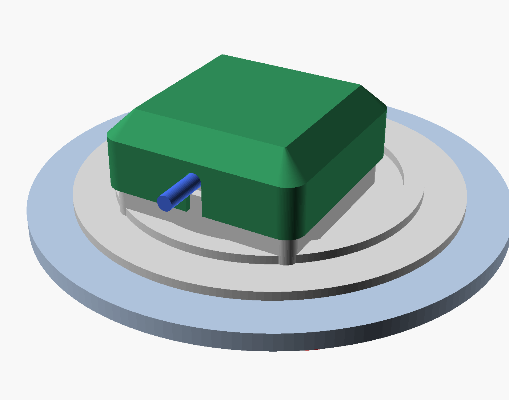
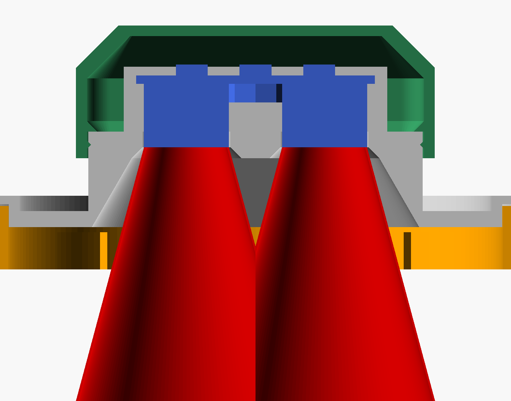
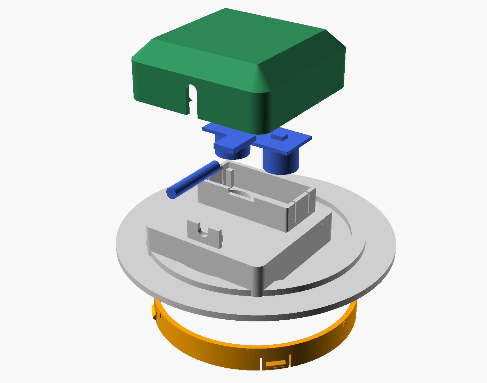
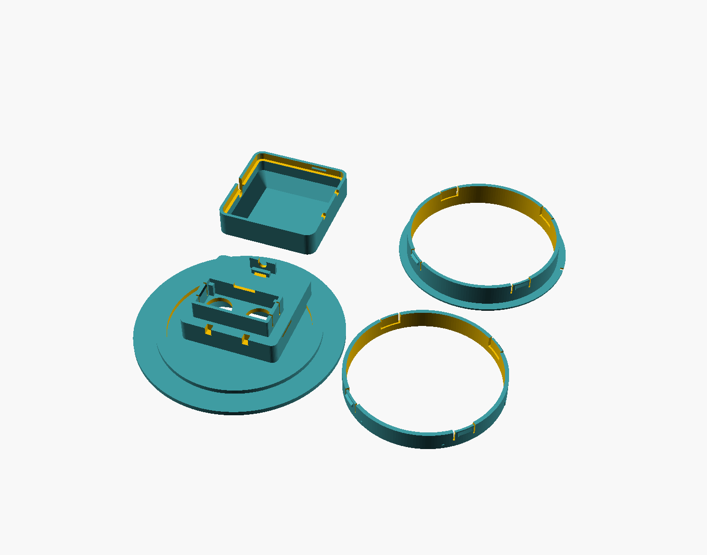

# HC-SR04 tank-top mount

Holds an HC-SR04 ultrasonic ranger over the ~100 mm filler hole of a water
canister (grow room "Location A", Rechts Primärtank). The transducers point
straight down into the tank. The PCB and connector sit under a lid that sheds
drips. Everything is set by the parameters in `hcsr04_tank_mount.scad`.

| Assembly | Section through both transducers |
| --- | --- |
|  |  |
|  |  |

In the section view the red cones are the 15° beam. They clear every wall down
through the collar.

## Parts

| Part | STL | Print orientation | Default size | Notes |
| --- | --- | --- | --- | --- |
| `base` | `stl/base.stl` | flange down | Ø130 × 30.2 mm | Flange, beam opening, deck, PCB cradle, cable gland |
| `collar` | `stl/collar.stl` | insert end (crush ribs) down | Ø98 × 12 mm | Centring spigot with 4 friction tabs. It presses into the groove under the flange |
| `lid` | `stl/lid.stl` | roof down | 67.5 × 66.4 × 25 mm | Hood with 45° shoulders, cable notch and 2 downward vents |
| `test_ring` | `stl/test_ring.stl` | lip down | Ø108 × 15 mm | Fit check for the hole. **Print this first** |

**Why the collar is a separate part:** if the spigot were part of the base,
there would be features below the flange (the spigot) and above it (the
plinth), and one side would always need supports. As two parts, both print
flat. The collar is held in the base by crush ribs (0.25 mm interference), so
no glue is needed.

## Key dimensions (defaults, echoed on every render)

| | |
| --- | --- |
| **Sensor-face height above rim** | **15.0 mm** (transducer front to the canister top surface) |
| Flange | Ø130 (hole_d + 30), 3 mm thick |
| Spigot / collar | Ø98 (hole_d − 2), 8 mm into the hole, 4 tabs reaching Ø100.6 |
| Top of lid above rim | 38 mm; overall height including the spigot 46 mm |
| Face recess | 2 mm, with a 45° countersink below the face (no tunnel) |
| Beam clearance (15° cone from the can rim) | 0.3 mm at the face (can bore), 1.76 mm at the deck underside, 5.79 mm at rim level, 19.4 mm inside the collar |

For the firmware, the reading is the distance from the transducer face. So:

```
level_below_rim_mm = measured_mm - 15.0      // face_above_rim
```

If you change `face_above_rim`, use the new value from the `SENSOR FACE HEIGHT
ABOVE RIM` echo line.

## Fit-check workflow (do this before the long print)

1. Measure the hole with calipers in 2–3 directions and take the average.
2. Set `hole_d` to that value: `-D hole_d=101.5`, or edit the top of the file,
   or use OpenSCAD's Customizer. `spigot_d` (hole_d − 2 × `spigot_clr`) and the
   flange follow automatically.
3. Print `test_ring` (≈15 min). Drop it into the hole with the lip up.
   - **Good fit:** the four tabs touch the hole wall and centre the ring. It
     goes in by hand and the lip sits flat on the rim.
   - **Loose / rattles:** raise `tab_interf` (e.g. 0.6), or lower `spigot_clr`.
   - **Won't go in:** your `hole_d` is too big. Lower it, or raise `spigot_clr`.
4. Once the test ring fits, print `collar`, `base` and `lid` with the same values.

```bash
openscad -o stl/test_ring.stl -D 'part="test_ring"' -D hole_d=101.5 hcsr04_tank_mount.scad
# or regenerate everything (STLs + PNGs) with overrides:
./build.sh -D hole_d=101.5
```

## Print settings (Bambu Lab, no supports)

- **Material: PETG.** It stands up to humidity and warmth. PLA creeps and
  softens in a warm, wet headspace. ASA is fine too.
- 0.4 mm nozzle, 0.2 mm layers, **4 walls** (2 mm walls end up as solid
  perimeters), 15–20 % gyroid infill, 4 top and 4 bottom layers.
- **Supports: off.** All overhangs are ≤45°. The only bridges are the
  collar-groove roof (2.9 mm), the zip-tie bar (8 mm) and the deck strip between
  the transducers (≈20 mm).
- On smooth PEI, put glue stick under PETG as a release agent. The textured
  plate works without it.
- Orientation is already baked into the STLs, so load them as they are.
- Tolerances: 0.3 mm around the PCB, the cans and the lid skirt; 0.15 mm in the
  collar groove, plus crush ribs. If your printer over-extrudes, raise
  `pcb_clr` / `tx_clr` / `lid_clr` by 0.1.

## Assembly

1. **Collar → base:** push the collar, insert end first (crush ribs), into the
   annular groove under the flange until it is flush. Use a bench vice or press
   it against the table. It should not come out by itself.
2. **Sensor:** the transducers go down through the two deck bores. The
   right-angle header must point towards the cable gland (the long side of the
   base). Press the PCB down until the two snap tongues on the short sides
   click over its back. The board rests on its four corners (front side). The
   hooks overlap only 0.8 mm at the middle of the short edges, so nothing
   presses on the SOIC ICs (U1/U2/U3) or the crystal. The corner holes are not
   used.
3. **Cable:** plug the Dupont housing onto the header pins, or solder a 4-core
   cable (Ø ≈5 mm, e.g. LiYY 4 × 0.25). There are 26 mm of bay for the housing
   and the bend. Lay the cable into the U of the gland wall. Loop a small zip
   tie through the tunnel under the tie bar, around the cable, and pull it
   tight. That is the strain relief. Loose jumper wires work too: bundle the
   four wires and tie them the same way.
4. **Lid:** slide it straight down. The slot in its gland side closes over the
   cable from above. The two detents on the long sides click into the grooves in
   the plinth. The lid rests on the top edge of the plinth, and its skirt hangs
   5 mm below that edge as a drip edge.
5. **On the tank:** the collar goes into the hole and the flange sits flat on
   the top.

## Humidity and drips

- The PCB sits ~24 mm above the flange, on top of a solid 5 mm deck, inside a closed hood. It is
  out of splash reach.
- The lid has 45° roof shoulders, and its skirt overlaps the plinth from
  outside, so water running down the lid drips off below the seam.
- There are two **labyrinth vents** at the bottom of the skirt on the side away
  from the cable. Air goes up a groove behind the skirt and under the lid ledge.
  Water cannot get in because the path runs upwards.
- **Cable:** leave a **drip loop** just outside the lid, so water running along
  the cable drips off before it reaches the gland.
- **Beam opening:** the opening below the transducers flares at 30° and the
  bores have a 45° countersink. Condensate on these walls runs outwards and
  down, not onto the transducer faces. There is no tunnel, which means no
  internal echoes.
- Optional: a thin bead of neutral-cure silicone around each can on top of the
  deck seals the 0.3 mm gap to the tank air. Conformal coating on the PCB back
  also helps, but keep it off the transducer meshes.

## Sensor dimensions used (measure yours, they are all parameters)

"HC-SR04 2020" revision (RCWL-9300 on the back, right-angle header). From the
user's photos:

| Parameter | Value | Source |
| --- | --- | --- |
| PCB | 45 × 20 × 1.6 mm | ElecFreaks/SparkFun datasheet: module 45 × 20 × 15 mm ([PDF](https://cdn.sparkfun.com/datasheets/Sensors/Proximity/HCSR04.pdf)) |
| Beam | <15° measuring angle | same datasheet; also [HowToMechatronics](https://howtomechatronics.com/tutorials/arduino/ultrasonic-sensor-hc-sr04/) |
| Transducers | Ø16, 12 mm tall, 26 mm pitch | common drawing values, matches the photos (15 mm module height − 1.6 mm PCB ≈ 13) |
| Corner holes | ~Ø2 mm, ~42 × 17 mm centres | [SparkFun forum caliper measurement](https://community.sparkfun.com/t/attaching-a-ultrasound-hc-sr04-unit/32443). Not used |
| Crystal | 11 × 4.5 × 3.5 mm, front, between the cans | photo (5.5 mm clear of the deck) |
| Header | right-angle, pins ≈10 mm past the long edge, body 2.5 mm on the back | photo |
| Back-side ICs | SOIC, ≈2 mm tall | photo. The cradle does not touch them |

## Open points

- `hole_d` = 100 mm is **not measured**. Run the test ring first.
- The can height (`tx_h`) sets the face height. If yours differ from 12 mm,
  the face moves by the same amount. Measure, set `tx_h`, and use the echoed
  face height.
- The supply voltage of this RCWL-9300 board variant is unverified (classic
  HC-SR04 is 5 V only). If the MCU is 3.3 V, put a divider on Echo unless the
  board is confirmed 3.3 V capable.
- The print has not been fitted to the real tank or board yet. The first print
  is the validation.

## Files

- `hcsr04_tank_mount.scad`: the model. `part = "assembly" | "exploded" |
  "section" | "all" | "base" | "collar" | "lid" | "test_ring"`
- `stl/`: binary STLs at the default parameters, in print orientation
- `img/`: preview renders
- `build.sh`: regenerates `stl/` and `img/` (`OPENSCAD=/path/to/openscad
  ./build.sh [-D …]`). It needs a recent OpenSCAD (2025+ snapshot, manifold
  backend) and uses `xvfb-run` when there is no display.
